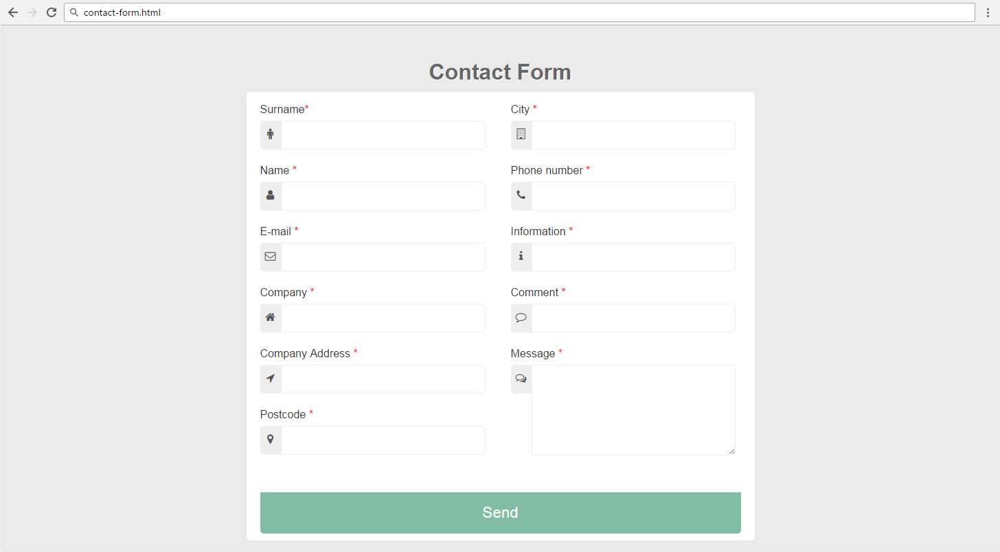
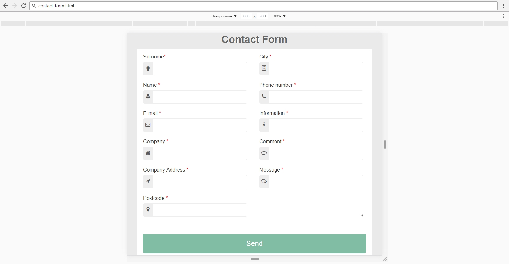
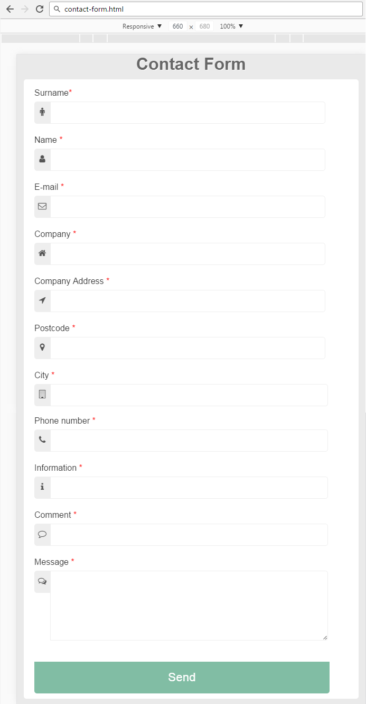

# Responsive-contect-form
Your task is to make the site responsive. The site layout should change according to the browser viewport / screen size at 660px and at 800px. 
 

With max-width 800px
 

With max-width 660px
 

